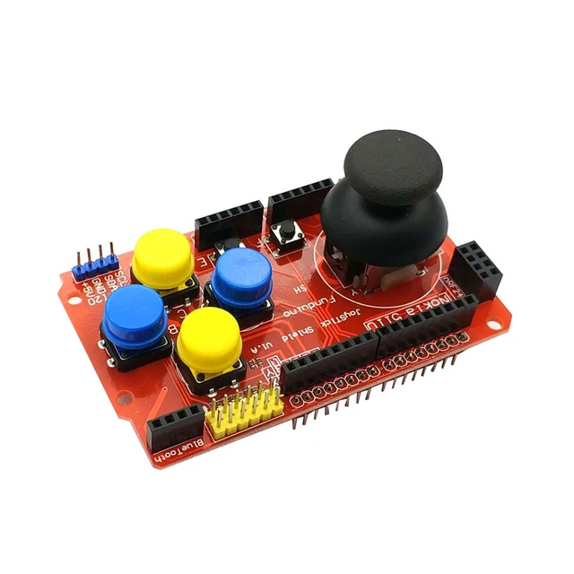
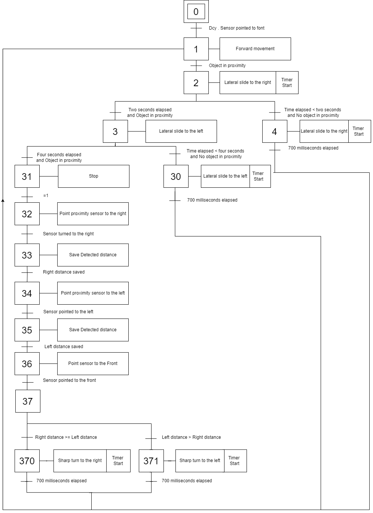

# 🤖 Multifunctional Robot Platform
Welcome to the Multifunctional Robot Platform project! This repository features the codebase for an advanced robot platform based on the STM Nucleo F446RE microcontroller. Designed to enhance hands-on learning in robotics, programming, and electronics, our platform is ideal for students and enthusiasts seeking practical experience.

## 🚀 Key Features

- **STM32 Nucleo F446RE Integration**: Leverages the STM32 Nucleo F446RE microcontroller for exceptional performance and versatility.
- **Comprehensive Applications**: Includes a diverse suite of applications for various robotic functionalities, such as locomotion control, sensor interfacing, and object avoidance.
- **Seamless Integration**: Accompanied by Arduino and Processing code for easy integration and customization.
- **Modular Design**: Facilitates expansion and adaptation to meet specific educational goals and project needs.

## 📚🔧 Robot Testing Scenarios

This repository contains the code and documentation for various tests performed on our robot. The tests are categorized into:

* **Locomotion** ⚙️
* **Autonomous Navigation**🧭
* **Radar Functionality** 📡
* **Sensor Functionality** 🔍

## Table of Contents
- [Locomotion](#locomotion)
  - [Movement Loop Test](#movement-loop-test)
  - [Remote Control via Bluetooth](#remote-control-via-bluetooth)
- [Autonomous Navigation](#autonomous-navigation)
  - [Object Avoidance and Interface Testing](#object-avoidance-and-interface-testing)
- [Radar Functionality Testing](#radar-functionality-testing)
  - [Test Setup](#test-setup)
  - [Equipment and Configuration](#equipment-and-configuration)
  - [Procedure](#procedure)
  - [Results](#results)
  - [Challenges](#challenges)
- [Sensor Functionality and Display Testing](#sensor-functionality-and-display-testing)
  - [Encoder and LCD Display Testing](#encoder-and-lcd-display-testing)
  - [IMU Sensor Accuracy and LCD Testing](#imu-sensor-accuracy-and-lcd-testing)
  - [Environmental Sensor Testing](#environmental-sensor-testing)

## ⚙️ Locomotion
### 🚶‍♂️ Movement Loop Test
___
The goal of this [testing scenario](LoopMotion) is to assess the locomotion capabilities of the educational robot platform by executing a predefined movement loop. 
A square is marked on the floor to establish the starting point where the robot will be positioned at the beginning of the test. It will then perform a series of reverse movements, aiming to return to the square by the test's conclusion. By comparing the robot's initial and final positions, we can evaluate the accuracy of its locomotion.   

### 🎮 Remote Control via Bluetooth
___
#### 📱 Components and Configuration

The main components involved in this [testing](RemoteControl) are an Arduino Uno with a joystick shield, and the STM microcontroller-based four-wheeled robot, each equipped with an HC-05 Bluetooth module.

1. **Arduino Uno with Joystick Shield**
   - The Arduino Uno serves as the primary interface for the joystick shield, which includes multiple buttons and a two-axis joystick. This setup captures the user's physical inputs and converts them into digital outputs.
   

    
  

2. **HC-05 Bluetooth Module (Master)**
   - Connected to the Arduino Uno, this module is configured as the master device. Using AT commands, it is set to automatically connect to the slave Bluetooth module and send joystick commands wirelessly to the robot.

3. **HC-05 Bluetooth Module (Slave)**
   - This module is attached to the robot and receives commands from the Arduino's Bluetooth module. It is configured with AT commands to be the slave module.

4. **STM Microcontroller-Based Robot**
   - The robot is equipped with an STM microcontroller that processes incoming commands for movement and operation, driving the motors accordingly.

#### 🔗 Interfacing and Connectivity

- **Joystick Shield and Arduino Uno**
  - The joystick shield is directly mounted on the Arduino Uno, interfacing through standard GPIO pins. The Arduino sketch (program) reads the joystick's position and button states, translating these into movement commands.
  - 
- **Bluetooth Communication**
  - The two HC-05 modules are paired such that the Arduino Uno acts as the master and the robot as the slave. A serial communication protocol is used between the HC-05 modules and the attached microcontrollers to transmit and receive commands.

#### 📶 Testing Process

1. **Initial Setup**
   - Both Bluetooth modules were paired, and communication links were established to ensure a stable connection over Bluetooth. The HC-05 modules were tested for range and interference issues in the intended operating environment.

2. **Functionality Testing**
   - **Command Transmission**: Each movement command (forward, backward, left, right, lateral, and diagonal movements) was initiated from the joystick and monitored to ensure it was correctly received and processed by the robot.
   - **Movement Execution**: The robot's response to each command was observed to ensure accurate execution of movements. This included verifying the latency, direction, speed, and smoothness of the movements.

## 🧭 Autonomous Navigation
### Algorithm Description

This [algorithm]() leverages a servo motor equipped with an ultrasonic sensor, a red LED, and a buzzer. Using a switch-case method, each step corresponds to specific actions based on sensor readings and predefined conditions.

1. **Forward Movement**
   - The robot moves forward.
   - If an obstacle is detected within 40 cm, a red LED illuminates, and a buzzer emits a sound for a set duration.
   - The algorithm proceeds to the next step.

2. **Right Lateral Movement**
   - The robot shifts for 2 seconds to the right while calculating the distance.
   - If the distance to the obstacle exceeds 100 cm and the elapsed time is less than two seconds, the robot continues moving right for 700 milliseconds, and the red LED turns off. The algorithm then returns to Step 1.
   - If not (object detected at a distance less than 100 cm and with 2 seconds elapsed), the algorithm proceeds to the next step.

3. **Left Lateral Movement**
   - The robot shifts left for twice the duration it slid right in Step 2.
   - If the distance to the obstacle exceeds 100 cm and the elapsed time is less than two seconds, the robot moves further left, the red LED turns off, and the algorithm returns to Step 1.
   - If not (object detected and distance less than 100 cm with 2 seconds elapsed), the algorithm proceeds to the next step.

4. **Ultrasonic Sensor Rotation**
   - The servo motor rotates the ultrasonic sensor to 0 degrees to measure the distance on the right side and save it.
   - Subsequently, the ultrasonic sensor rotates to 180 degrees to measure the distance on the left side and save it.
   - Comparing the distances, the robot turns towards the side with the greater distance (90 degrees rotation; the time to make a 90° turn was tested and saved).
   - The red LED turns off, and the algorithm returns to Step 1.

    
  

## 📡 Radar Functionality Testing

### Test Setup

The [radar functionality test](Radar_app) is designed to evaluate the effectiveness of the ultrasonic sensor mounted on a servo motor in detecting objects within a specified range and direction (angle). The test environment is set up by positioning the robot stationary with multiple objects dispersed within a 150° arc in front of it. These objects are placed at varying distances to assess the sensor's range and accuracy in a controlled setting.

### Equipment and Configuration

- **Servo Motor**
  - A servo motor is utilized to provide precise control over the angular position of the ultrasonic sensor. The servo is programmed to sweep from 15° to 165° with a 2° step.
  
- **Ultrasonic Sensor**
  - Mounted on the servo motor, the ultrasonic sensor measures the distance to objects at every direction (every 2° sweep) given by the servo motor.

- **Processing Software**
  - For every step of the servo motor, the microcontroller captures the distance using the ultrasonic sensor and sends the data in real-time to the processing computer through the UART interface. The STM microcontroller is connected to a computer with a USB cable. The computer runs a Java code on the Processing software, interpreting the data and rendering a visual representation of the robot's surroundings based on the detected distances and angles received.

### Procedure

1. Initialize the robot in a predefined position with the servo motor set at 0°.
2. Begin the test by activating the servo motor to rotate the ultrasonic sensor. This rotation is carried out in increments of 2°.
3. At each 2° increment, the ultrasonic sensor records the distance to any object within its field of view. Simultaneously, the corresponding angle (direction) of the servo motor is also recorded.
4. Transmit the angle and distance data to the Processing software. This transmission occurs in real-time as the servo moves.
5. Continue the sweep until the servo reaches 165°. At this point, the sensor would have scanned a 180° wide arc in front of the robot.
6. The Processing software, having received the full range of data, uses this information to create a radar display of the environment. This visual displays the locations and distances of the objects detected within the 180° field of view.
7. Sweep back from the 180° direction to the 0° direction, performing the same transmission and so on.

## 🔍 Sensor Functionality and Display Testing

### Encoder and LCD Display Testing
___
In this [testing scenario](Encoders), we evaluate the functionality of the encoders and LCD integrated into the educational robot platform.

#### Objectives
The objective is to assess the accuracy of distance measurement using encoders and to verify the functionality of the LCD in presenting encoder data.

#### Testing Setup
Two encoders capture the rotation of the motors at the rear of the robot. The encoders measure the rotation of the motors, allowing for distance calculation. Simultaneously, the LCD presents the encoder counts for each motor, providing real-time feedback during the test. The robot is programmed to move forward until it reaches a distance of 3 meters, as determined by the encoder readings using the following equation:

\[ \text{Distance} = \left( \frac{E}{2 \cdot F} \right) \cdot \pi \cdot D \]

Where:
- \( E \): The sum of both Rising and Falling edges detected.
- \( F \): The number of slots on the encoder disk.
- \( D \): The Diameter of the nonholonomic wheel.

#### Test Procedure
1. **Encoder Testing**
   - The robot is initially tested to evaluate the accuracy of distance measurement using encoders alone. It moves forward, and the distance covered is calculated based on the encoder readings.

2. **Encoder and LCD Display Testing**
   - Subsequently, the robot undergoes testing with the LCD enabled, which refreshes every program loop for instantaneous real-time visualization. It follows the same forward movement procedure while simultaneously displaying the encoder counts on the LCD screen.

### IMU Sensor Accuracy and LCD Testing
___
The primary objective of this [test](MPU_TiltTracking) is to evaluate the accuracy and responsiveness of the Inertial Measurement Unit (IMU) sensor integrated into the educational robot. This involves monitoring the sensor's ability to accurately measure angular velocity, acceleration, and orientation of the robot, and using the data sent from the STM Serial to visualize it with Processing in Real-time.

### Environmental Sensor Testing*
___
In this [testing](TempHumi_Tracking), we are going to test the environmental sensor accuracy on the educational robot, using the DHT22 sensor for measuring temperature and humidity. The test aims to assess the sensor's responsiveness and accuracy in real-time, with data outputs displayed on an LCD screen integrated into the robot.

## How to Run the Tests
To run these tests, follow the instructions provided in each test's respective Description above, the source code is provided for each Test. There is also a bunch test code, that takes all of these tests and the user can select which test to run using Interface (Buttons, LCD, LEDs..).

## Contributions
Feel free to open issues or submit pull requests for improvements or additional tests.

